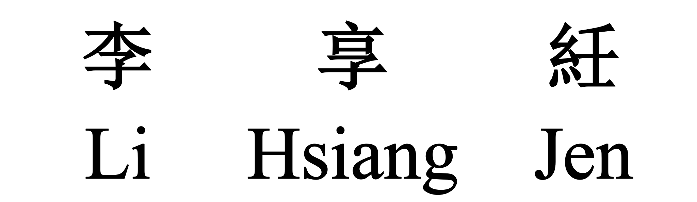

  

# **Hsiang-Jen-Li** <small><small><small><small> RN </small></small></small></small>

<a href="mailto: hsiangjenli@gmail.com">
    
**hsiangjenli@gmail.com**

</a>

  

**National Taiwan University of Science and Technology**, Taiwan  
Master in Department of Industrial Management

**National Kaohsiung University of Science and Technology**, Taiwan  
Bachelor in Department of Money and Banking

  
<table>

<tr>
    <td>Host</td>
    <td>Year</td>
    <td>Competition Name</td>
    <td>Ranking</td>
</tr>

<tr>
    <td>  </td>
    <td> 2022 </td>
    <td> <b> National Kaohsiung University of Science and Technology - Electrical Engineering </b> Joint Exhibition on Artificial Intelligence and Neural Networks </td>
    <td> 1 </td>

</tr>

<tr>
    <td>  </td>
    <td> 2020 </td>
    <td> <b> Fintech Space </b> Campus Achievement Exhibition </td>
    <td> Competition's preferred choice </td>

</tr>

</table>  